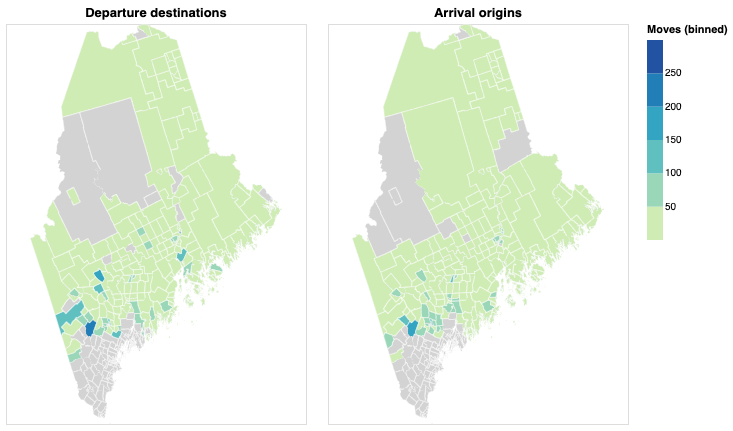

# maine-migration
Patrick Lavallee Delgado \
September 2020

## Overview

This project attempts to simulate tract-to-tract move counts from estimated county-to-county quantities in the American Community Survey, five-year migration flows, by the US Census Bureau. The analysis considers migration in and out of southern Maine, but the approach is applicable to any geography.

## Southern Maine

The underlying assumption of this simulation is that individuals move to sort themselves among people more like themselves and less like their neighbors. This is precisely why census tracts, which are drawn for homogeneity, are more desirable than counties, which have arbitrary bounds, as the unit of analysis. This section explores the result of the simulation for moves between the Portland-South Portland-Biddeford metropolitan statistical area and other parts of Maine. This MSA consists of Cumberland, Sagadahoc, and York counties in their entireties and I refer to the region as "southern Maine" for convenience.

Moves to and from southern Maine, which is the economic center of the state, can reveal connectedness with communities in northern Maine, which is its cultural heart. The results of the simulation are not all that surprising, as they include the larger cities and towns in the rest of the state. But notably, neither Bangor nor Augusta register among the most frequent destination for departures from southern Maine or origin for arrivals to southern Maine. For context, Bangor is the third-largest city and a former lumber capital and Augusta is the capital of the state. The map and tables below tally these findings.

### Departures from and arrivals to southern Maine



### Top ten destinations for departures from southern Maine

| Census tract | Town | Moves |
| --- | ---- | ---: |
| 23019006300 | Orono | 284 |
| 23017966400 | Oxford | 217 |
| 23001020300 | Lewiston | 185 |
| 23007971200 | Farmington | 172 |
| 23001020900 | Lewiston | 149 |
| 23007971400 | Jay | 120 |
| 23009965300 | Bucksport | 114 |
| 23001020700 | Lewiston | 114 |
| 23011024102 | Waterville | 113 |
| 23017966000 | Woodstock | 101 |

### Top ten origins for arrivals to southern Maine

| Census tract | Town | Moves |
| --- | ---- | ---: |
| 23001020700 | Lewiston | 198 |
| 23001020300 | Lewiston | 189 |
| 23017966400 | Oxford | 169 |
| 23019006300 | Orono | 149 |
| 23011024200 | Waterville | 146 |
| 23001020900 | Lewiston | 135 |
| 23001020400 | Lewiston | 106 |
| 23017966500 | Norway | 100 |
| 23001044000 | Livermore Falls | 88 |
| 23001020800 | Lewiston | 88 |

## Implementation

I developed this project using Python 3.7.4 and it requires the standard library, `numpy` 1.16.4, `pandas` 1.1.3, and their dependencies.

The simulation runs on the command line and writes origin-destination tract pairs to standard output. It accepts arguments for origin county FIPS code `--from`, destination county FIPS code `--to`, and year `--in` in the data. Neither county FIPS code is required.

The `--db_path` argument gives the location of the database of ACS data, which by default is at `acs/acs.sqlite3`, and the `--seed` arguments sets the starting position of the random number generator.

The snippet below runs the simulation for tract-to-tract moves from all counties to Cumberland County, Maine, observed in 2015 and redirects the output:

```
$ python3 run_simulation.py --to 23005 --in 2015 > out
```

### Data

The data is from the American Community Survey, five-year estimates, from the US Census Bureau. There are two datasets: county-to-county migration flows and tract-level profile characteristics. I use the migration flows data to set the number of moves to simulate between counties, and the profile characteristics data to assign origin-destination tract pairs to each move. It is important to emphasize that these data are period estimates collected over five years, which, while not exact to the year, do offer complete geographic coverage.

I download these data from their API and store in a SQLite database. Please see my [get-census](https://github.com/lavalleedelgado/get-census) repository for the complete implementation. The YAML files in the `acs/` directory prescribe the data to collect.

### Simulation

The program `simulate_moves.py` (1) constructs a probability mass function that describes the probability of a move from each tract in the origin county to each tract in the destination county and (2) makes as many draws from the distribution as moves observed in the data. The probability of an origin-destination tract pair is the product of the corresponding departure-arrival events and some weight that expresses the similarity of those tracts.

A tract with more departures/arrivals receives a higher probability of departure/arrival. I estimate departures from a tract as the difference between (1) the number of people in the current year who lived in the same residence one year previous and (2) the number of people over one year old in the previous year. The data identify arrivals to a tract from the same county, a different county in the same state, or a different state. I choose the population of arrivals that matches the origin county. The data account for people who lived abroad one year previous but I do not simulate those moves.

Tract pairs for which the characteristics of departures are more similar to those of arrivals receive higher weights. I calculate similarity as the Euclidean distance between vectors that describe departures/arrivals by percent white, black, Hispanic, Asian, bachelor's degree attainment. I do not use median income because, unlike other measures, it is not estimable without a reference distribution. The equations below show how to decompose a tract characteristic `c` at time step `t` to describe subpopulations of departures, arrivals, remainers:

```
c_{t-1}(departures + remainers) = c_{d}departures + c_{r}remainers
c_{t}(remainers + arrivals) = c_{r}remainers + c_{a}arrivals

c_{t-1}(departures + remainers) - c_{d}departures = c_{t}(remainers + arrivals) - c_{a}arrivals
```

This gives one equation with two unknowns, each for the coefficient on departures `c_{d}` and arrivals `c_{a}`. To keep the estimation tractable, I assume arrivals share the characteristics of remainers and ignore that the remainers changes between time steps. Departures are representative of change in the origin tract from the previous year. Arrivals are representative of the destination tract in the current year.

There are cases when the coefficient on departures is negative and reveals information on the coefficient on arrivals. I update the corresponding characteristic for departures to zero, but I do not update that for arrivals because it would seem to misguide the vector of characteristics and favor selection of tract pairs on a lumpy mixture of assumptions.

I want to emphasize the two critical assumptions: (1) a tract is a more likely destination when it is more similar to the change in the tract from which the mover originates and (2) departures/arrivals are representative of their origins/destinations. Also, and because departures from and arrivals to tracts are known, the simulation only considers neighborhood choice and does not model the move decision. That is beyond the scope of intention for this project, but I do share my thoughts in the next section.

This approach constructs the entire probability mass function to describe a move as one decision instead of as two disjoint events. I think this is a more natural interpretation. But also, selecting tract pairs in two draws would oversample origins/destinations with more departures/arrivals, whichever draws first. Instead, the pmf has many discrete events that the probability of any tract pair is very small. I sort the probabilities such that a random draw of the distribution is from a region of similarly likely possibilities.

## Future work

This project neither models the move decision nor forecasts move counts in unobserved years. This is challenging because the time series is zero-inflated count data with just nine observations. A defendable data generating process would also include other predictors such as birth, death, and workforce indicators that tend to have better coverage at the county level. So, I would model tract-level population and county-to-county move counts and repeat the present work to simulate the tract-to-tract quantities for future years. It would also be interesting to simulate a joint distribution of mover occupation and demographic profile.
